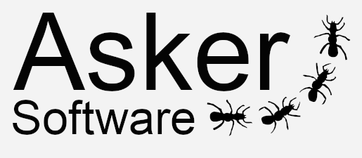

Generate a lot of questions from your own _input definitions file_.

---

# Description

ASKER helps trainers to create a huge amount of questions, from a definitions input file.

Steps:

1. Create an [input file](./docs/inputs/README.md) file with your definitons.
1. Run [asker](docs/commands.md) and get the results at `output` directory.

## Features

* Free Software [LICENSE](LICENSE).
* Multiplatform.
* Input files formats: HAML, XML.
* DSL to write your definitions ([concepts](docs/inputs/README.md)).
* Output file format: GIFT (Moodle cuestionairs), YAML.
* Programming language: Ruby.

---

# Usage

To execute ASKER, we use `asker` command, and as argument, a path to an input file. For example, to run "jedi.haml" input file example, we do:

```
asker en/starwars/jedi.haml
```

* By default, `asker` generates your output files into the `output` directory.
* In this example, we use a demo input definition file called `en/starwars/jedi.haml`, that contains conceptual entities about _"Jedi's context"_.
* You can find more input files into `github/dvarrui/asker-inputs` repository.

---

# Documentation

* [Installation](./docs/install/README.md)
    * [Scripts](docs/inouts/scripts.md)
    * [Manual](docs/inputs/manual.md)
* [Inputs](./docs/inputs/README.md)
    * [Concepts](docs/inputs/concepts.md)
    * [Tables](docs/inputs/tables.md)
    * [Templates](docs/inputs/templates.md)
    * [Code](docs/inputs/code.md)
* [Commands](./docs/commands.md)
* [Contributions](./docs/contributions.md)
* [Base idea](./docs/idea.md)
* [History](./docs/history.md)

---

# Contact

* **Email**: `asker.software@protonmail.com`
* **Twitter**: `@AskerSoftware`
