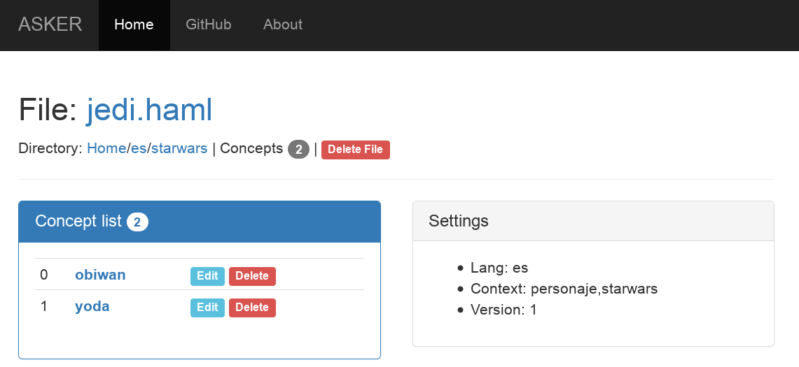

[<< back](../../README.md)

# Inputs

---

## Text plain editor

How to build our asker input files?

Run a plain text editor and start
* [Learning basics](learn.md)
* [Learning about tables](tables.md)

---

## Web editor (On development)

Asker has a web editor to help building our asker input files.
By now only read, do not write. Sorry! Still is on development.

Looks like this:

To launch web editor:
1. `asker editor`
1. Open web browser and goto URL `localhost:4567`.

---

## More examples

Download our git repository with a lot of examples:
* `asker donwnload` or
* `git clone https://github.com/dvarrui/asker.git`
